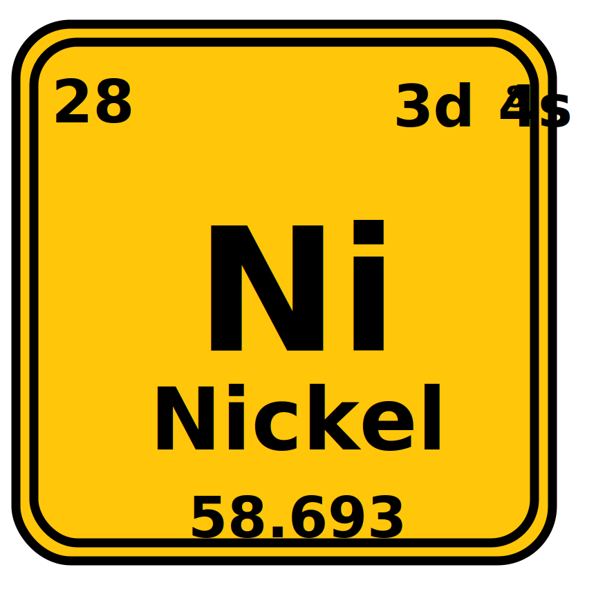

# Nickelium

<p align="center">
  
</p>

Nickelium is an agent-first browser runtime built on top of [Servo](https://github.com/servo/servo).

It is not trying to be a better general-purpose human browser than Chrome. The point is narrower and more useful: give AI agents a browser they can drive natively, tune per task, and run in parallel without paying the full cost of a consumer browser stack every time.

## Why care

Most browser automation stacks are still `agent -> CDP client -> Chrome -> website`. That is powerful, but heavy. Nickelium changes the shape of the stack:

- Native Rust control surface inside the browser runtime
- Task profiles that strip subsystems agents often do not need
- One-process agent workflows instead of a many-process Chrome tree
- DOM-first control paths for extraction, admin flows, verification, and proof screenshots
- A CLI-first distribution that can also install as a Codex skill

If your workload is authenticated SaaS automation, queue processing, dashboard auditing, admin CRUD, or form-driven back-office work, Nickelium is the right kind of browser to optimize.

## What you get

- `nickelium`: a single CLI that starts and drives the browser runtime
- Native commands for `start`, `open`, `click`, `fill`, `wait`, `text`, `eval`, `html`, `snapshot`, `screenshot`, `status`, `shutdown`, and `workflow`
- Isolated named instances for concurrent agent sessions
- Built-in task profiles:
  - `workflow`
  - `dom-audit`
  - `visual-proof`
  - `compat-signin`
- Real browser-engine fixes in the codebase instead of site-specific JS hacks
- A Codex skill payload that lets agents call Nickelium directly after install

## Where it wins

Nickelium is strongest on authenticated, DOM-first tasks where the agent cares about state changes and proof, not full human browsing fidelity.

Examples:

- Open a support/admin tool, update a record, verify the new state, save a proof screenshot
- Audit a dashboard, extract counters and alert banners, and attach a screenshot
- Walk a queue of back-office forms in many isolated sessions on one machine

It is not the right tool for media-heavy consumer browsing, visual polish review, or sites that hard-require Chrome-specific behavior.

## Benchmark snapshot

These figures come from the local synthetic admin/dashboard workflows used during development. They compare Nickelium against [`agent-browser`](https://github.com/vercel-labs/agent-browser) on top of Chrome on the same Mac.

Notes:

- latency = end-to-end elapsed workflow time
- memory = peak RSS of the browser stack
- process count = peak browser process count during the run
- bars are normalized within each chart
- these are workload-specific development benchmarks, not general web benchmarks

### Batched DOM-first workflows

This is the workload Nickelium is currently best at: deterministic admin actions where the agent can batch DOM work and does not need full consumer-browser fidelity.

Plain DOM workflow latency (lower is better):

```text
Nickelium                ████████████████████████████████░░░░  1672 ms  ★
Chrome + agent-browser   ████████████████████████████████████  1893 ms
```

Plain DOM workflow peak RSS (lower is better):

```text
Nickelium                ██████░░░░░░░░░░░░░░░░░░░░░░░░░░░░░░  172 MB  ★
Chrome + agent-browser   ████████████████████████████████████  1004 MB
```

Heavy DOM workflow latency (lower is better):

```text
Nickelium                ████████████████████████████████░░░░  1742 ms  ★
Chrome + agent-browser   ████████████████████████████████████  1985 ms
```

Heavy DOM workflow peak RSS (lower is better):

```text
Nickelium                ████░░░░░░░░░░░░░░░░░░░░░░░░░░░░░░░░  172 MB  ★
Chrome + agent-browser   ████████████████████████████████████  1545 MB
```

What this means:

- On the plain batched workflow, Nickelium was `11.7%` faster and used `82.8%` less peak RSS.
- On the heavy batched workflow, Nickelium was `12.2%` faster and used `88.9%` less peak RSS.
- This is the sharpest current Nickelium win: DOM-first, batchable back-office work.

### Screenshot-heavy proof workflows

When the workload demands proof screenshots immediately after navigation and rendering, Nickelium still wins on memory, but not yet on elapsed time.

Approval workflow + proof screenshot latency (lower is better):

```text
Nickelium                ████████████████████████████████████  3731 ms
Chrome + agent-browser   ██████████████░░░░░░░░░░░░░░░░░░░░░░  1483 ms  ★
```

Approval workflow + proof screenshot peak RSS (lower is better):

```text
Nickelium                ████████████████░░░░░░░░░░░░░░░░░░░░  677 MB  ★
Chrome + agent-browser   ████████████████████████████████████  1554 MB
```

Dashboard audit + proof screenshot latency (lower is better):

```text
Nickelium                ████████████████████████████████████  3713 ms
Chrome + agent-browser   ████████████░░░░░░░░░░░░░░░░░░░░░░░░  1190 ms  ★
```

Dashboard audit + proof screenshot peak RSS (lower is better):

```text
Nickelium                ███████████████░░░░░░░░░░░░░░░░░░░░░  642 MB  ★
Chrome + agent-browser   ████████████████████████████████████  1498 MB
```

What this means:

- On the approval proof flow, Nickelium used `56.4%` less peak RSS, but Chrome finished faster.
- On the dashboard proof flow, Nickelium used `57.1%` less peak RSS, but Chrome finished faster.
- The current weak point is screenshot-heavy, render-dominated work right after navigation.

### Process count

Across the recorded workflows above, Nickelium stayed in a single browser process while the Chrome stack expanded to nine:

```text
Nickelium                ████░░░░░░░░░░░░░░░░░░░░░░░░░░░░░░░░  1 proc  ★
Chrome + agent-browser   ████████████████████████████████████  9 proc
```

### Takeaway

Nickelium is not a universal “faster than Chrome” claim. The current read is more specific:

- Nickelium already wins on both time and memory for batched DOM-first agent workflows.
- Nickelium already wins decisively on memory and process density across the board.
- Nickelium still needs more work on screenshot-heavy, render-dominated flows.

## Install

The primary install path is CLI-first:

```bash
curl -fsSL https://raw.githubusercontent.com/Grail-Computer/Nickelium/main/support/nickelium/install.sh | bash
```

That installer:

- downloads the latest GitHub release bundle for your platform
- installs the runtime under `~/.local/share/nickelium/runtime`
- symlinks `nickelium` into `~/.local/bin`
- installs the Codex skill into `$CODEX_HOME/skills/nickelium`

The first public release currently ships a macOS arm64 binary. Other targets can build from source for now.

## Use as a skill

After installation, Codex-compatible agents can use the bundled Nickelium skill directly.

The skill lives at:

- `support/nickelium/skill` in this repository
- `$CODEX_HOME/skills/nickelium` after running the installer

If you already have the repository locally and only want the skill/runtime install step:

```bash
bash support/nickelium/install.sh
```

## CLI quickstart

```bash
nickelium start
nickelium open https://example.com
nickelium text h1
nickelium screenshot /tmp/example.png
nickelium shutdown
```

For isolated parallel sessions:

```bash
nickelium --instance audit-1 start
nickelium --instance audit-2 start
```

For repeatable automation:

```bash
nickelium workflow workflow.json
```

## Build from source

Nickelium lives in the Servo source tree. To build the lean agent runtime:

```bash
cargo build -p servoshell --bin nickelium --release --no-default-features --features agent-runtime
```

To package a GitHub release asset from a checked-out tree:

```bash
bash support/nickelium/scripts/build_release.sh
```

## Repository layout

- `ports/servoshell/agent.rs`: agent CLI and workflow runner
- `ports/servoshell/agent_control.rs`: native request/response control server
- `ports/servoshell/running_app_state.rs`: browser-side command execution
- `ports/servoshell/prefs.rs`: task profiles and lean runtime defaults
- `support/nickelium/install.sh`: GitHub-backed installer
- `support/nickelium/skill`: Codex skill payload

## Status

Nickelium is useful now for narrow agent workflows, not for replacing Chrome everywhere.

The current product thesis is:

> Nickelium is a low-overhead browser runtime for agents doing authenticated SaaS and admin work, with DOM-first control and proof screenshots.

## Upstream, inspiration, and license

Nickelium is built from and derived from [servo/servo](https://github.com/servo/servo), and it keeps the Servo codebase structure.

The agent-control direction was also informed by [vercel-labs/agent-browser](https://github.com/vercel-labs/agent-browser), especially as a reference point for what an agent-first browser workflow can look like on top of Chrome.

Credit where it is due:

- [servo/servo](https://github.com/servo/servo) for the browser engine and upstream foundation
- [vercel-labs/agent-browser](https://github.com/vercel-labs/agent-browser) for pushing the agent-browser UX forward

See [LICENSE](LICENSE) for licensing terms.
